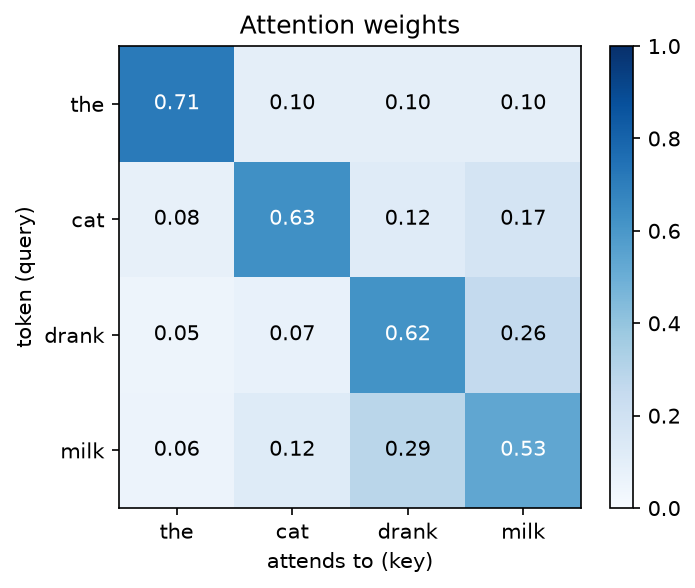
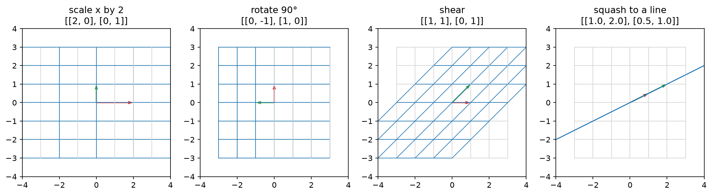
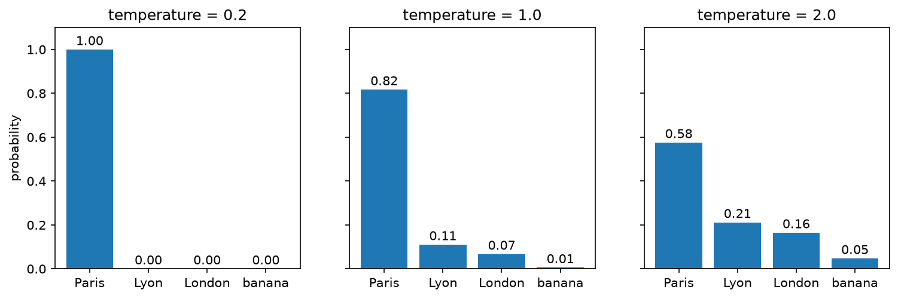

# Math for LLM

Linear algebra and probability from scratch in a single Jupyter notebook,
ending with a step-by-step mini attention mechanism.
Every function is written by hand in plain Python and checked against NumPy with `np.allclose`.



## What's inside

| Topic | Built from scratch | Why it matters for LLMs |
|---|---|---|
| Vectors & embeddings | `magnitude`, `normalize`, king − man + woman | Text is represented as vectors |
| Dot product & cosine | `dot_product`, `cosine_similarity`, mini semantic search | How RAG retrieves relevant documents |
| Matrices | `matmul`, grid transformations, AB ≠ BA | Every LLM layer is a matrix multiplication |
| Probability | Bayes, `softmax`, temperature sampling | How the next token is chosen |
| Mini attention | `softmax(QKᵀ/√d)·V`, causal mask | The core of the Transformer |





## Run it

```bash
git clone https://github.com/kardi06/math-for-llm.git
pip install -r math-for-llm/requirements.txt
jupyter notebook math-for-llm/math-for-llm.ipynb
```

Tip: create a virtual environment first (`python -m venv .venv`) to keep the packages isolated.
